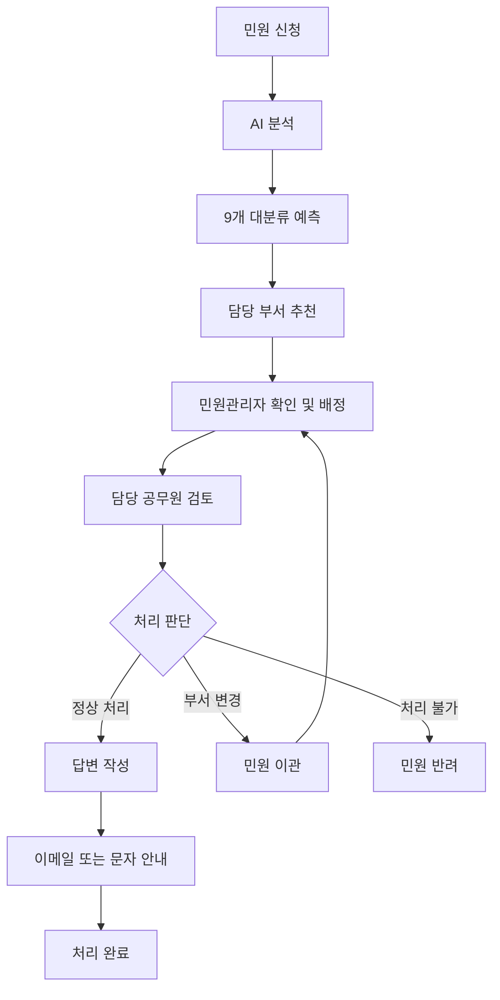

# Developer Study Archive

AI 개발 전문가 과정과 개인 학습 내용을 정리한 학습 아카이브입니다.  
Python 기반 데이터 분석, 머신러닝, 딥러닝, 자연어 처리와 LLM 활용을 중심으로 Java, Oracle Database, Spring Boot, React, Git/GitHub까지 웹 서비스 개발 전반의 학습 기록과 프로젝트 경험을 정리합니다.

<br>

## Contents

- [Overview](#overview)
- [Tech Stack](#tech-stack)
- [Python & AI](#python--ai)
- [Java](#java)
- [Oracle Database](#oracle-database)
- [Spring Boot](#spring-boot)
- [React](#react)
- [Git & GitHub](#git--github)
- [Team Projects](#team-projects)
  - [심근경색 발생 위험도 예측 웹 서비스](#1-심근경색-발생-위험도-예측-웹-서비스)
  - [BDI 운임지수 예측 프로젝트](#2-bdi-운임지수-예측-프로젝트)
  - [AI 기반 민원 자동 분류 및 행정 지원 서비스](#3-ai-기반-민원-자동-분류-및-행정-지원-서비스)
- [AI 모델 개발 및 문제 해결 기록](#ai-모델-개발-및-문제-해결-기록)
- [Repository Purpose](#repository-purpose)

<br>

## Overview

이 저장소는 AI 개발 전문가 과정에서 학습한 프로그래밍, 데이터 분석, 인공지능, 웹 개발 내용을 정리하기 위한 공간입니다.

단순한 개념 학습에 그치지 않고, Python 기반 데이터 분석과 머신러닝·딥러닝·LLM 모델 구현, Spring Boot와 React를 활용한 웹 서비스 개발, Oracle Database 연동, Git/GitHub 협업 경험까지 실제 프로젝트 흐름에 맞춰 정리하는 것을 목표로 합니다.

<br>

## Tech Stack

| Category          | Skills                                              |
| ----------------- | --------------------------------------------------- |
| Language          | Python, Java, SQL, JavaScript                       |
| Data Analysis     | Pandas, NumPy                                       |
| Machine Learning  | Scikit-learn                                        |
| Deep Learning     | TensorFlow, Keras, ANN, DNN, RNN, LSTM, TextCNN     |
| NLP & Transformer | Keras Tokenizer, KLUE-BERT, KoELECTRA, KcELECTRA    |
| LLM               | Ollama, Gemma, Llama, LangChain, Prompt Engineering |
| Visualization     | Matplotlib, Seaborn                                 |
| Backend           | Spring Boot, Flask, REST API, JDBC                  |
| Frontend          | React, React Router, Axios                          |
| Database          | Oracle Database                                     |
| Collaboration     | Git, GitHub, Pull Request                           |

<br>

## Python & AI

### 학습 내용

- Python 기초 문법 및 객체지향 프로그래밍(OOP)
- Pandas, NumPy를 활용한 데이터 처리 및 분석
- Matplotlib, Seaborn을 활용한 데이터 시각화
- 웹 크롤링 및 데이터 수집
- 데이터 전처리 및 특성 선택(Feature Engineering)
- 머신러닝 모델 개발 및 성능 평가
- TensorFlow, Keras 기반 딥러닝 모델 개발
- 인공신경망(ANN), 심층신경망(DNN), 순환신경망(RNN), LSTM, CNN 학습
- 자연어 전처리, 토큰화, 임베딩, 패딩 처리
- Transformer와 사전 학습 언어 모델을 활용한 텍스트 분류
- LLM(Large Language Model)의 기본 개념과 로컬 모델 활용
- Prompt Engineering 및 Few-shot 분류 프롬프트 설계
- 이진 분류, 다중 클래스 분류, 다중 라벨 분류 모델 구현
- 정확도, 정밀도, 재현율, F1-score, Loss, 오차행렬 기반 성능 평가
- REST API를 활용한 AI 모델 호출 및 웹 서비스 연동

### 머신러닝과 딥러닝 이해

머신러닝은 데이터를 기반으로 패턴을 학습하여 새로운 데이터에 대한 결과를 예측하거나 데이터를 구조화하는 인공지능 기술입니다.  
본 학습 과정에서는 문제 유형에 따라 분류, 회귀, 군집 모델을 구분하여 학습하고, 각 모델의 목적에 맞는 성능 평가 지표를 활용했습니다.

#### 머신러닝 모델 유형

| 유형                 | 설명                                            | 활용 모델                                                               | 성능 평가                                               |
| -------------------- | ----------------------------------------------- | ----------------------------------------------------------------------- | ------------------------------------------------------- |
| 분류(Classification) | 데이터를 정해진 범주로 예측하는 방식            | Logistic Regression, Decision Tree, Random Forest, SVM, KNN             | Accuracy, Precision, Recall, F1-score, Confusion Matrix |
| 회귀(Regression)     | 연속적인 수치 값을 예측하는 방식                | Linear Regression, Random Forest Regressor, Gradient Boosting Regressor | MAE, MSE, RMSE, R2 Score                                |
| 군집(Clustering)     | 정답 라벨 없이 데이터의 유사한 그룹을 찾는 방식 | K-Means, DBSCAN, Hierarchical Clustering                                | Silhouette Score, 군집 분포 시각화                      |

분류 모델은 예측 결과가 실제 클래스와 얼마나 일치하는지뿐만 아니라, Precision과 Recall을 함께 확인하여 오탐과 미탐의 균형을 평가했습니다.  
회귀 모델은 실제 값과 예측 값의 차이를 MAE, MSE, RMSE로 비교하고, R2 Score를 통해 모델이 데이터를 얼마나 잘 설명하는지 확인했습니다.  
군집 모델은 데이터 간 유사도를 기반으로 그룹을 나누고, Silhouette Score와 시각화를 통해 군집이 적절하게 형성되었는지 분석했습니다.

#### 딥러닝 모델 이해

딥러닝은 인공신경망을 기반으로 복잡한 데이터의 특징을 자동으로 학습하는 머신러닝의 한 분야입니다.  
TensorFlow와 Keras를 활용하여 ANN, DNN, CNN 모델의 구조를 학습하고, 데이터 특성에 따라 분류와 회귀 문제에 적용했습니다. 또한 LLM의 기본 개념과 자연어 처리 분야에서의 활용 방식을 함께 학습했습니다.

| 유형             | 설명                                                                 | 주요 개념                                                        | 성능 평가                                          |
| ---------------- | -------------------------------------------------------------------- | ---------------------------------------------------------------- | -------------------------------------------------- |
| ANN 분류 모델    | 입력 데이터를 여러 클래스 중 하나로 예측하는 신경망 모델             | Dense Layer, Activation Function, Cross Entropy, Softmax/Sigmoid | Accuracy, Precision, Recall, F1-score, Loss        |
| ANN 회귀 모델    | 입력 데이터를 기반으로 연속적인 수치 값을 예측하는 신경망 모델       | Dense Layer, ReLU, MSE Loss, Optimizer                           | MAE, MSE, RMSE, Loss                               |
| DNN 모델         | 여러 은닉층을 쌓아 복잡한 비선형 패턴을 학습하는 심층신경망 모델     | Hidden Layer, Backpropagation, Dropout, Batch Normalization      | Accuracy, Loss, MAE, RMSE                          |
| RNN/LSTM 모델    | 텍스트처럼 순서가 있는 데이터의 문맥과 흐름을 학습하는 모델          | Embedding, Sequence, Hidden State, LSTM Unit                     | Accuracy, Precision, Recall, F1-score, Loss        |
| CNN/TextCNN 모델 | 이미지 또는 텍스트의 지역적 패턴과 핵심 특징을 추출하는 모델         | Convolution Layer, Pooling, Filter, Feature Map                  | Accuracy, Precision, Recall, F1-score, Loss        |
| Transformer 모델 | Attention을 기반으로 문장 전체의 관계와 문맥을 학습하는 모델         | Self-Attention, Tokenizer, Fine-tuning                           | Accuracy, Macro F1-score, Loss                     |
| LLM              | 대규모 텍스트 데이터를 기반으로 자연어를 이해하고 생성하는 언어 모델 | Token, Embedding, Transformer, Prompt Engineering                | 응답 정확성, 일관성, 문맥 이해도, 활용 목적 적합성 |

딥러닝 모델 학습 과정에서는 손실 함수(Loss Function), 활성화 함수(Activation Function), 옵티마이저(Optimizer), Epoch, Batch Size 등의 개념을 학습했습니다.  
DNN은 은닉층을 깊게 구성하여 복잡한 패턴을 학습하는 구조로 이해했으며, CNN은 Convolution과 Pooling 과정을 통해 이미지 데이터의 특징을 추출하는 방식으로 학습했습니다.  
또한 학습 데이터와 검증 데이터의 성능 차이를 비교하여 과적합 여부를 확인하고, Dropout, Early Stopping 등의 방법을 통해 모델의 일반화 성능을 개선하는 과정을 실습했습니다. 이진 분류에서는 Sigmoid와 Binary Cross Entropy를, 다중 클래스 분류에서는 Softmax와 Sparse/Categorical Cross Entropy를 사용하도록 출력층과 손실 함수를 구분했습니다.

LLM은 대규모 언어 데이터를 기반으로 문장을 이해하고 생성하는 모델로, Transformer 구조와 Prompt Engineering의 기본 개념을 학습했습니다.  
특히 LLM은 정량적인 정확도뿐만 아니라 응답의 정확성, 일관성, 문맥 이해도, 활용 목적에 맞는 결과 생성 여부를 함께 고려하여 평가할 수 있음을 이해했습니다.

### 자연어 처리 모델 학습

민원 분류와 비속어 탐지 실습을 통해 문장 데이터를 다루는 전체 과정을 학습했습니다.

- 정규표현식을 이용한 텍스트 정제와 공백 처리
- Tokenizer를 이용한 정수 인코딩과 Padding
- Embedding Layer를 이용한 단어 표현 학습
- RNN/LSTM, TextCNN, DNN 기반 텍스트 분류
- KLUE-BERT, KoELECTRA, KcELECTRA 기반 Transformer 분류
- 이진 분류와 9개 클래스 분류에 맞는 출력층 및 손실 함수 설정
- 클래스 불균형, 과적합, 재현성 문제 확인
- 검증 데이터와 테스트 데이터를 분리한 모델 비교

### 모델 성능 평가 방법

모델은 단일 지표만으로 결정하지 않고 여러 평가 결과를 함께 확인했습니다.

| 평가 항목                | 확인 목적                                            |
| ------------------------ | ---------------------------------------------------- |
| Training/Validation Loss | 학습 수렴 여부와 과적합 확인                         |
| Accuracy                 | 전체 예측 중 정답의 비율 확인                        |
| Precision                | 특정 클래스로 예측한 결과의 정확성 확인              |
| Recall                   | 실제 클래스 데이터를 놓치지 않는지 확인              |
| Macro F1-score           | 클래스별 성능을 동일한 비중으로 종합 평가            |
| Confusion Matrix         | 어떤 클래스끼리 자주 혼동하는지 분석                 |
| 처리 시간                | 전체 실행 시간과 민원 1건당 평균·최소·최대 시간 확인 |

Best Model은 Accuracy만 보지 않고 Validation Loss, Macro F1-score, 클래스별 Recall, 과적합 여부와 처리 시간을 종합하여 선정했습니다.

### LLM 및 프롬프트 설계 학습

로컬 환경에서 Ollama 기반 Gemma·Llama 모델을 실행하고, 모든 모델에 동일한 공통 프롬프트를 적용하여 분류 성능을 비교했습니다.

- 역할, 작업 목표, 허용 라벨, 출력 형식을 명확하게 작성
- 모호할 때 사용할 기본 라벨과 금지 조합을 절대 규칙으로 지정
- 기본은 단일 라벨로 판단하고, 서로 다른 행정 조치가 필요한 경우에만 다중 라벨 허용
- Few-shot 예시는 문장 표면 유사도보다 대상과 요청 조치의 유사성을 우선
- 출력 이후 허용 라벨 확인, 공백 제거, 중복 제거 등의 후처리 적용
- `temperature=0`을 사용하여 결과 변동을 줄이고 반복 실행으로 안정성 확인
- 실제 서비스에서는 요청당 한 번 예측하고, 평가 단계에서는 여러 번 실행하여 일관성 점검

학습한 머신러닝 및 딥러닝 개념은 심근경색 발생 위험도 예측, BDI 운임지수 예측, AI 기반 민원 자동 분류 프로젝트에 적용하여 실제 데이터를 기반으로 모델을 구현하고 서비스와 연결하는 경험으로 확장했습니다.

### 활용 프로젝트

- 심근경색 발생 위험도 예측 웹 서비스
- BDI 운임지수 예측 프로젝트
- AI 기반 민원 자동 분류 및 행정 지원 서비스

<br>

## Java

### 학습 내용

- Java 기초 문법
- 객체지향 프로그래밍(OOP)
- 클래스 및 상속
- 인터페이스 및 다형성
- 예외 처리(Exception Handling)
- 컬렉션 프레임워크(Collection Framework)
- 파일 입출력 및 JDBC 활용

<br>

## Oracle Database

### 학습 내용

- 데이터베이스 설계 및 데이터 모델링
- ERD(Entity Relationship Diagram) 작성
- SQL 기본 문법
- JOIN 및 SubQuery 활용
- 제약조건(Constraint) 설정
- 데이터 정규화
- Oracle DB 연동 및 관리

<br>

## Spring Boot

### 학습 내용

- Spring Boot 기반 웹 애플리케이션 개발
- REST API 설계 및 구현
- Controller, Service, Repository 계층 구조 이해
- Oracle DB 연동
- CRUD 기능 구현
- 로그인 및 회원 관리 기능 개발
- 게시판 기능 구현
- API 테스트 및 예외 처리

<br>

## React

### 학습 내용

- 컴포넌트 기반 개발(Component-Based Architecture)
- State 및 Props 활용
- React Hooks 활용
- React Router를 활용한 페이지 관리
- Axios를 활용한 REST API 연동
- 사용자 인터페이스(UI) 구현
- SPA(Single Page Application) 구조 이해

<br>

## Git & GitHub

### 학습 내용

- Git 기본 명령어 활용
- 로컬 및 원격 저장소 관리
- 브랜치 생성 및 관리
- Merge 및 충돌 해결
- Pull Request(PR) 활용
- GitHub 협업 경험
- 형상관리 및 버전 관리

### 여러 컴퓨터에서 같은 저장소 작업하기

처음 사용하는 컴퓨터에서는 원격 저장소를 Clone하고, 이후부터는 작업 전에 Pull, 작업 후 Commit과 Push를 진행합니다.

```bash
# 처음 한 번만 실행
git clone https://github.com/사용자명/저장소명.git
cd 저장소명

# 작업 시작 전
git pull origin main

# 작업 완료 후
git add .
git commit -m "작업 내용"
git push origin main
```

개인 브랜치를 사용하는 경우에는 `main` 대신 자신의 브랜치로 이동하여 최신 내용을 받은 뒤 작업합니다.

```bash
git switch 브랜치명
git pull origin 브랜치명
git add .
git commit -m "작업 내용"
git push origin 브랜치명
```

### Git 사용 시 확인한 문제

- Git 저장소 안에 또 다른 `.git` 폴더가 있으면 `embedded git repository` 경고가 발생할 수 있습니다.
- 일반 폴더로 올릴 목적이라면 내부 저장소의 `.git`을 제거한 뒤 다시 추가해야 합니다.
- 별도의 저장소로 연결할 목적이라면 Submodule을 사용합니다.
- 다른 컴퓨터에서 작업할 때는 같은 폴더를 다시 `git init`하는 것보다 `git clone`을 사용하는 것이 안전합니다.
- Push 전에 Pull을 실행하여 원격 저장소와 로컬 저장소의 차이를 먼저 확인합니다.

<br>

## Team Projects

### 1. 심근경색 발생 위험도 예측 웹 서비스

사용자의 건강 관련 데이터를 기반으로 심근경색 발생 위험도를 예측하는 웹 서비스입니다.  
데이터베이스 설계부터 백엔드 API, 프론트엔드 화면, 머신러닝 예측 기능 연동까지 전체 서비스 흐름을 팀 프로젝트로 구현했습니다.

#### 주요 내용

- Oracle DB 설계 및 데이터 관리
- Spring Boot REST API 개발
- React 기반 사용자 인터페이스 구현
- 머신러닝 모델 학습 및 예측 기능 연동
- Git/GitHub 기반 협업 진행

#### 기술 스택

`Python` `Spring Boot` `React` `Oracle Database` `Git` `GitHub`

<br>

### 2. BDI 운임지수 예측 프로젝트

BDI(Baltic Dry Index) 운임지수 데이터를 수집하고 전처리한 뒤, 다양한 머신러닝 모델을 비교하여 운임지수를 예측한 데이터 분석 프로젝트입니다.

#### 주요 내용

- 데이터 수집 및 전처리
- 머신러닝 모델 비교 및 성능 평가
- 운임지수 예측 모델 개발
- 예측 결과 분석 및 시각화
- 데이터 기반 의사결정 지원

#### 기술 스택

`Python` `Pandas` `NumPy` `Scikit-learn` `Matplotlib` `Seaborn`

<br>

### 3. AI 기반 민원 자동 분류 및 행정 지원 서비스

시민이 입력하거나 음성으로 접수한 민원을 AI가 분석하고, 민원 대분류와 담당 부서를 추천하여 공무원의 반복 업무를 지원하는 서비스입니다. AI가 최종 행정 판단을 대신하는 것이 아니라, 분석 결과를 제공하고 민원관리자와 담당 공무원이 최종 확인하는 Human-in-the-loop 방식으로 설계했습니다.

#### 프로젝트 목표

- 민원 접수 과정의 반복적인 확인·분류 업무 감소
- 음성 민원의 STT 변환과 부적절 언어 탐지
- 비표준어를 표준어로 변환하여 분석 정확도 향상
- 민원 내용에 맞는 9개 대분류 자동 예측
- 필요한 경우 서로 다른 행정 조치를 다중 라벨로 분류
- AI 분류 결과를 기반으로 담당 부서 추천
- 관리자와 공무원이 배정·이관·반려·답변을 처리하는 업무 흐름 구현

#### 전체 민원 처리 흐름



AI 분석 단계에는 STT, 비속어 탐지, 비표준어 변환, 민원 카테고리 분류가 포함됩니다. 회원에게는 이메일, 비회원에게는 문자로 처리 결과를 안내하도록 서비스 흐름을 구성했습니다.

#### 민원 9개 대분류

| 번호 | 대분류             |
| ---: | ------------------ |
|    1 | 지자체\_도시시설   |
|    2 | 지자체\_환경위생   |
|    3 | 지자체\_교통안전   |
|    4 | 지자체\_복지안전   |
|    5 | 기관\_행정민원     |
|    6 | 지자체\_행정세무   |
|    7 | 지자체\_지역경제   |
|    8 | 지자체\_건축도시   |
|    9 | 기관\_일반소관확인 |

#### 데이터 정제 및 라벨링 원칙

18개 원본 파일을 9개 대분류 체계로 통합하고, 실제 서비스와 LLM 평가에 사용할 데이터를 정제했습니다.

- 완전히 같은 문장과 의미가 같은 변형 문장 제거
- 지역명·기관명 등 반복적인 표현을 줄이고 문장 다양화
- 짧은 민원과 2~3줄 이상의 긴 민원을 균형 있게 구성
- 오분류와 다중 라벨을 문맥에 맞게 재검수
- 각 카테고리의 데이터 분포와 테스트 데이터 균형 확인
- 사람이 작성한 민원처럼 자연스러운 표현 유지
- 결과 데이터는 `민원`, `실제 대분류` 컬럼으로 단순화

정제된 주요 학습 데이터 30,000건의 클래스 분포는 다음과 같습니다.

| 대분류             | 데이터 수 |
| ------------------ | --------: |
| 지자체\_도시시설   |     9,990 |
| 지자체\_환경위생   |     5,885 |
| 지자체\_교통안전   |     4,118 |
| 지자체\_복지안전   |     3,022 |
| 기관\_행정민원     |     1,729 |
| 지자체\_행정세무   |     1,611 |
| 지자체\_지역경제   |     1,443 |
| 지자체\_건축도시   |     1,411 |
| 기관\_일반소관확인 |       791 |

클래스 수의 차이가 크기 때문에 전체 Accuracy와 함께 Macro F1-score, 클래스별 Recall과 Confusion Matrix를 확인하는 것이 중요합니다.

다중 라벨은 한 문장에 여러 대상이 등장했다는 이유만으로 부여하지 않고, 실제로 서로 다른 담당 부서의 행정 조치가 각각 필요한 경우에만 사용했습니다. 원인과 피해 설명은 별도 요청이 아니면 추가 라벨로 판단하지 않았습니다.

`기관_일반소관확인`은 내용만으로 담당 분야를 결정하기 어렵거나 9개 분류에 직접 대응하지 않는 경우에 사용하며, 다른 라벨과 동시에 출력하지 않도록 규칙을 고정했습니다.

#### 주요 AI 기능

| 기능             | 목적                              | 적용 방식                                |
| ---------------- | --------------------------------- | ---------------------------------------- |
| STT              | 음성 민원을 텍스트로 변환         | 음성 입력 전처리 단계에서 적용           |
| 비속어 탐지      | 부적절한 표현 차단 및 경고        | RNN/LSTM, CNN, DNN 기반 분류 비교        |
| 비표준어 변환    | 비표준 표현을 표준어로 정규화     | 비표준어-표준어 사전 및 단어 단위 변환   |
| 민원 대분류      | 민원을 9개 행정 분야로 분류       | RNN, TextCNN, DNN, Transformer, LLM 비교 |
| 과분리 판단      | 단일 라벨과 다중 라벨 여부 결정   | 서로 다른 행정 조치의 존재 여부 확인     |
| 담당 부서 추천   | 분류 결과를 실제 처리 부서와 연결 | 대분류와 부서 그룹 매핑                  |
| 문장·키워드 변환 | 답변 작성과 요약 업무 지원        | 키워드→문장, 문장→키워드 변환            |

#### 딥러닝 및 Transformer 모델 비교

9개 민원 대분류 실험에서는 동일한 전처리와 데이터 분할 기준을 적용해 모델 성능을 비교했습니다. Keras 모델은 어휘 수 10,000개와 문장 길이 40을 기준으로 전처리하고, Transformer는 최대 입력 길이 128을 사용했습니다. 데이터는 학습·검증·테스트를 6:2:2로 분리하고 클래스 비율을 유지하도록 Stratified Split을 적용했습니다.

| 모델      | Test Accuracy |
| --------- | ------------: |
| RNN(LSTM) |        78.43% |
| TextCNN   |        78.00% |
| DNN       |        76.85% |
| KLUE-BERT |        77.23% |
| KoELECTRA |        77.00% |
| KcELECTRA |        76.90% |

RNN/LSTM은 문장의 순서를 반영하는 장점이 있고, TextCNN은 핵심 구문 패턴을 빠르게 추출할 수 있습니다. DNN은 구조가 단순하고 학습 속도가 빠르지만 단어 순서와 긴 문맥을 직접 반영하기 어렵습니다. Transformer는 문장 전체의 관계를 잘 이해하지만 학습 자원과 시간이 더 필요합니다.

#### 로컬 LLM 모델 비교

Ollama에서 여러 Gemma·Llama 모델에 동일한 공통 프롬프트를 적용하고, 100건의 테스트 데이터로 정확도를 비교했습니다.

| 순위 | 모델       | 정답 | 오답 | 정확도 |
| ---: | ---------- | ---: | ---: | -----: |
|    1 | gemma4:12b |   90 |   10 |    90% |
|    2 | gemma4     |   77 |   23 |    77% |
|    2 | gemma4:e4b |   77 |   23 |    77% |
|    4 | gemma2:9b  |   76 |   24 |    76% |
|    5 | gemma3:12b |   74 |   26 |    74% |
|    6 | gemma3     |   65 |   35 |    65% |
|    7 | llama3.1   |   64 |   36 |    64% |
|    8 | llama3     |   56 |   44 |    56% |
|    9 | gemma      |   43 |   57 |    43% |

현재 실험에서는 `gemma4:12b`가 가장 높은 90% 정확도를 기록했습니다. 목표 정확도 95% 이상을 위해 오분류 사례를 분석하고, 분류 규칙과 Few-shot 예시의 적용 범위를 조정하는 실험을 진행했습니다.

#### LLM 분류 핵심 규칙

1. 반드시 9개 허용 라벨 중 최소 1개를 출력합니다.
2. 기본은 단일 라벨이며, 서로 다른 행정 조치가 명확할 때만 다중 라벨을 출력합니다.
3. `기관_일반소관확인`은 다른 라벨과 함께 출력하지 않습니다.
4. 문의, 담당자, 확인 등의 단어가 있다는 이유만으로 일반소관확인으로 분류하지 않습니다.
5. Few-shot 예시는 다수결이 아니라 대상과 요청 조치가 가장 비슷한 사례를 우선합니다.
6. 예측 결과에 허용되지 않은 설명이나 라벨이 포함되면 후처리에서 제거하거나 오답으로 처리합니다.

#### Ollama API 적용 및 안정화

초기에는 LangChain의 `ChatOllama.invoke()`를 사용했으나, 일부 긴 민원과 `gemma4:12b` 실행에서 빈 문자열이 반복되는 문제가 발생했습니다. 이후 Ollama의 `/api/generate`를 직접 호출하는 방식으로 변경하여 빈 응답을 줄이고 전체 예측 결과가 저장되도록 개선했습니다.

주요 실행 설정은 다음과 같습니다.

```python
options = {
    "temperature": 0,
    "num_predict": 50
}

payload = {
    "model": model_name,
    "prompt": prompt,
    "stream": False,
    "think": False,
    "keep_alive": "10m",
    "options": options
}
```

- 요청 제한 시간은 긴 민원을 고려해 최대 600초로 설정
- 빈 응답 또는 일시적 오류 발생 시 최대 3회 재시도
- 재시도 사이에 약 3초 간격 적용
- 모델을 메모리에 유지하기 위해 `keep_alive="10m"` 사용
- 분류 라벨 길이에 맞게 `num_predict=50` 사용
- 같은 조건의 모델 비교를 위해 공통 프롬프트와 옵션 유지

#### 평가 결과 저장 및 분석

각 민원 예측 결과에는 모델명, 민원 내용, 실제 라벨, 예측 라벨, 정답 여부와 처리 시간을 저장했습니다.

- 모델별 전체 데이터 수, 정답 수, 오답 수, 정확도 계산
- 정확도 내림차순 요약표 생성
- 모델별 오분류 데이터만 별도의 CSV 파일로 저장
- 여러 번 실행한 결과를 `pd.concat()`으로 통합
- 전체 실행 시간과 민원 1건당 평균·최소·최대 시간 계산
- 응답 시간이 비어 있을 때 `ZeroDivisionError`가 발생하지 않도록 리스트 길이 확인
- 단일 모델만 실행한 결과도 기존 8개 모델 결과와 합쳐 최종 비교표 생성

#### 화면 및 업무 기능 설계

- 일반 사용자: 홈, 회원가입, 로그인, 민원 신청, 민원 조회, 콜센터, 자주 찾는 민원, 마이페이지
- 민원 상세: 접수 상태 확인, 접수 중 수정·삭제, 처리 결과 확인
- 공무원: 민원 목록, 민원 상세, AI 분석 결과 확인, 답변 작성, 이관·반려 처리
- 민원관리자: AI 추천 부서 확인, 담당 공무원 배정, 미분류 민원 관리, 이관 2회 이상 민원 확인
- 관리자: 공무원 계정과 부서 정보 관리

민원 상세 화면에는 별도의 AI 분석 결과 버튼을 두어 분류 결과, 추천 부서, 비속어·비표준어 분석 결과를 확인하도록 목업을 설계했습니다.

#### 참고 서비스 및 자료

- [국민권익위원회 민원 빅데이터 분석 서비스](https://bigdata.epeople.go.kr/bigdata/bigMainPage.npaid)
- [민원 빅데이터](https://bigdata.epeople.go.kr)

#### 기술 스택

`Python` `Pandas` `TensorFlow` `Keras` `Transformers` `Ollama` `LangChain` `Flask` `REST API` `Spring Boot` `React` `Oracle Database` `Git` `GitHub`

<br>

## AI 모델 개발 및 문제 해결 기록

### 재실행할 때 정확도가 달라지는 이유

모델을 다시 실행했을 때 정확도가 달라질 수 있는 원인을 정리했습니다.

- LLM의 `temperature`와 샘플링 옵션
- 신경망 가중치 초기화와 데이터 Shuffle
- Train/Validation/Test 분할 시 Random Seed 차이
- Dropout 등 학습 단계의 무작위 동작
- 모델 버전, 프롬프트 또는 전처리 방식의 변경

비교 실험에서는 Random Seed, 데이터 분할, 전처리, 프롬프트, 모델 옵션을 고정하고 결과를 3회 정도 반복 측정하여 평균과 변동 폭을 확인합니다. 실제 서비스에서는 같은 요청을 여러 모델로 반복 실행하기보다 선정된 모델을 한 번 호출하는 방식이 처리 시간과 비용 면에서 적절합니다.

### 민원 분류 데이터 검수 기준

- 민원에 등장한 단어 하나가 아니라 전체 문맥과 실제 요청을 기준으로 라벨링
- 시설의 위치 변경, 수리, 단속, 지원 신청 등 핵심 행정 조치를 우선 확인
- 문장 안의 배경 설명과 민원인이 실제로 요구하는 내용을 분리
- 사람, 동물, 시설처럼 대상이 다르면 비슷한 단어가 있어도 별개 사례로 판단
- 애매한 데이터는 억지로 특정 카테고리에 넣지 않고 일반소관확인 규칙 적용
- 테스트 데이터는 학습 데이터와 의미상 중복되지 않도록 검수

### 비속어 탐지 모델 설계

비속어 탐지는 전체 민원 대분류보다 목적이 단순한 이진 또는 3개 클래스 분류 문제로 설계했습니다. RNN/LSTM과 CNN은 문장 내 표현 패턴을 학습하는 데 충분히 활용할 수 있으며, 데이터와 성능이 요구 수준을 만족하면 Transformer를 반드시 추가할 필요는 없습니다.

- 이진 분류: 정상/욕설을 Sigmoid 출력으로 분류
- 3개 클래스 분류: 정상/욕설/무의미 문장 등을 Softmax 출력으로 분류
- 예측 확률과 기준값을 함께 표시하여 사용자 경고 또는 차단 여부 결정
- 오차행렬을 통해 정상 문장을 욕설로 판단하는 오탐과 욕설을 놓치는 미탐 확인

### 비표준어를 표준어로 변환하는 방법

대규모 학습 데이터가 부족한 경우에는 사전 기반 방법을 우선 적용하고, 실제 민원에서 자주 등장하는 비표준 표현을 계속 추가하는 방식으로 구축합니다.

1. 공개 표준어·비표준어 자료와 프로젝트 데이터에서 표현 쌍을 수집합니다.
2. 비표준어 → 표준어 매핑 사전을 만듭니다.
3. 문장을 형태소 또는 단어 단위로 분리하여 사전에 있는 표현을 변환합니다.
4. 띄어쓰기, 반복 문자, 자모 분리, 구어체 변형 규칙을 추가합니다.
5. 변환 전후 문장을 사람이 검수하여 의미가 달라지는 오류를 제거합니다.
6. 실제 민원에서 발견된 새 표현을 사전에 누적합니다.

### 프롬프트 설계 절차

1. 모델이 수행할 역할과 최종 목표를 정의합니다.
2. 입력 데이터와 허용할 출력 형식을 고정합니다.
3. 분류 기준, 우선순위, 금지 사항을 절대 규칙으로 작성합니다.
4. 헷갈리는 경계 사례를 중심으로 Few-shot 예시를 추가합니다.
5. 정상 사례, 애매한 사례, 다중 라벨 사례를 함께 테스트합니다.
6. 오답을 유형별로 모아 규칙 부족과 예시 충돌을 구분합니다.
7. 모든 비교 모델에 같은 프롬프트를 적용하고 버전을 기록합니다.
8. 정확도뿐 아니라 빈 응답, 형식 오류, 실행 시간도 함께 평가합니다.

### 모델 선택 원칙

모델 크기가 크다고 항상 서비스에 가장 적합한 것은 아닙니다. 최종 모델은 정확도, 클래스별 성능, 응답 안정성, 실행 시간, 메모리 사용량, API 연동 편의성과 실제 서비스 환경을 함께 고려하여 선택합니다.

### 하이퍼파라미터 및 옵티마이저 비교

LSTM Unit, Dense Unit, 은닉층 수, Dropout과 Optimizer를 조합해 여러 모델을 학습할 때는 한 번에 하나의 조건만 바꾸거나 조합별 결과를 표로 저장합니다.

- LSTM Unit: 32, 64, 128
- Dense Unit: 32, 64
- 은닉층 수: 1, 2, 3
- 과적합 방지: Dropout, Early Stopping
- Optimizer 비교: Adam, RMSprop 등

튜닝 과정에서는 Validation 성능으로 모델을 선택하고, Test 데이터는 최종 모델을 결정한 뒤 한 번 평가하는 것이 데이터 누수를 줄이는 방법입니다. 결과 그래프는 Accuracy·Precision·Recall·F1-score처럼 범위가 같은 지표끼리 비교하고, Loss는 별도 그래프로 분리하면 모델 간 차이를 더 명확하게 확인할 수 있습니다.

## Repository Purpose

이 저장소는 학습 과정에서 다룬 개념, 실습 코드, 프로젝트 경험을 체계적으로 정리하기 위한 공간입니다.

각 기술을 단순히 학습하는 데 그치지 않고, 실제 웹 서비스와 데이터 예측 프로젝트에 적용하며 개발 역량을 확장하는 것을 목표로 합니다. 또한 학습 내용을 꾸준히 기록하여 개인 포트폴리오와 성장 기록으로 활용하고자 합니다.
